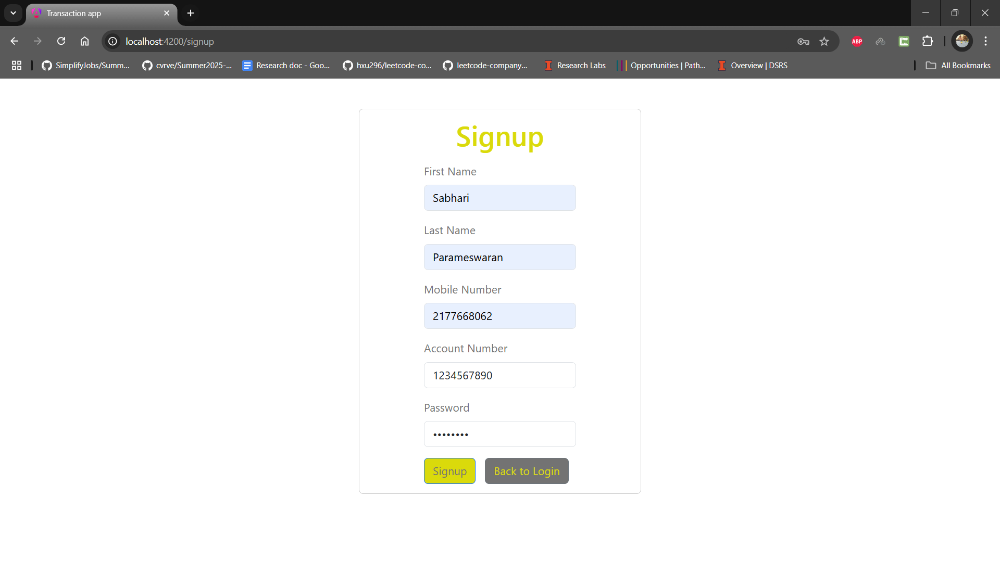
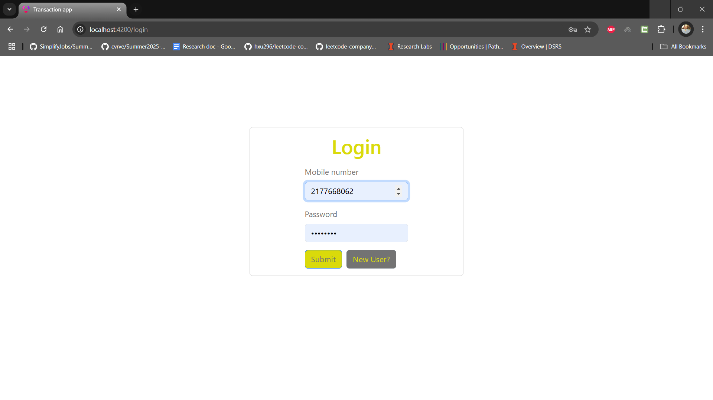
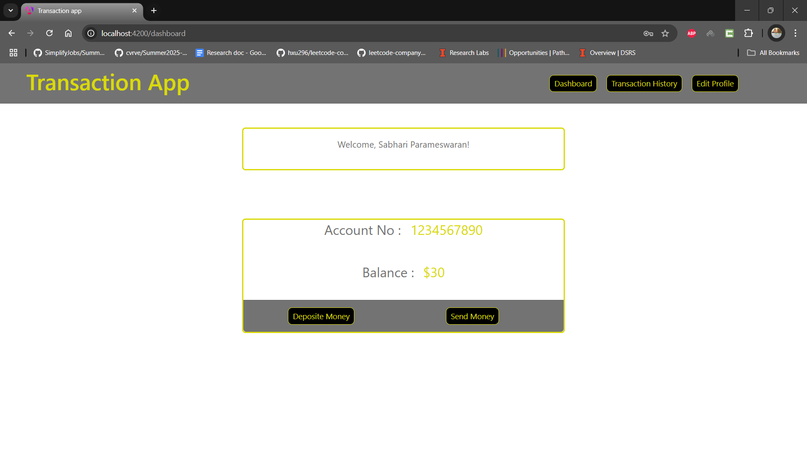
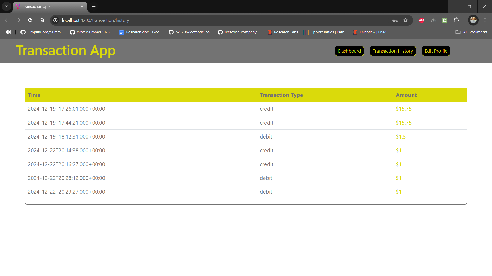
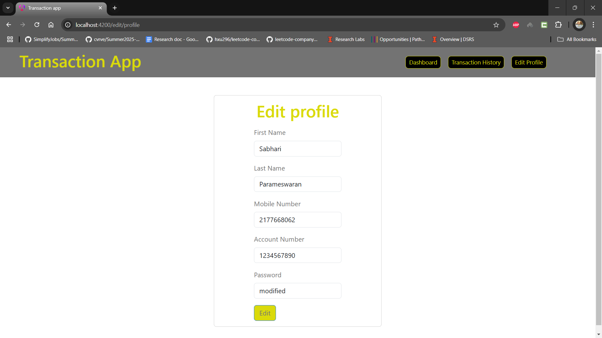
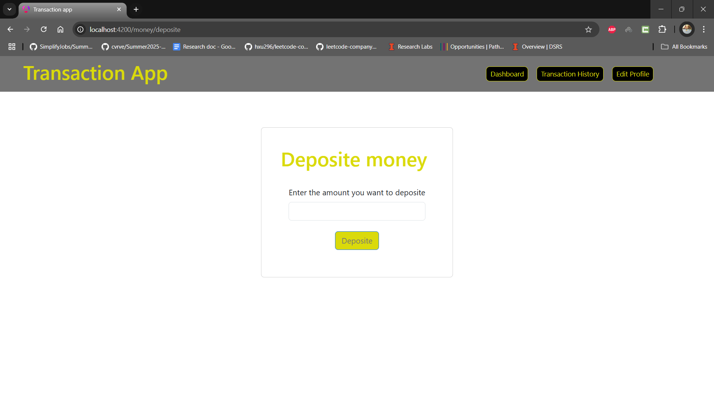
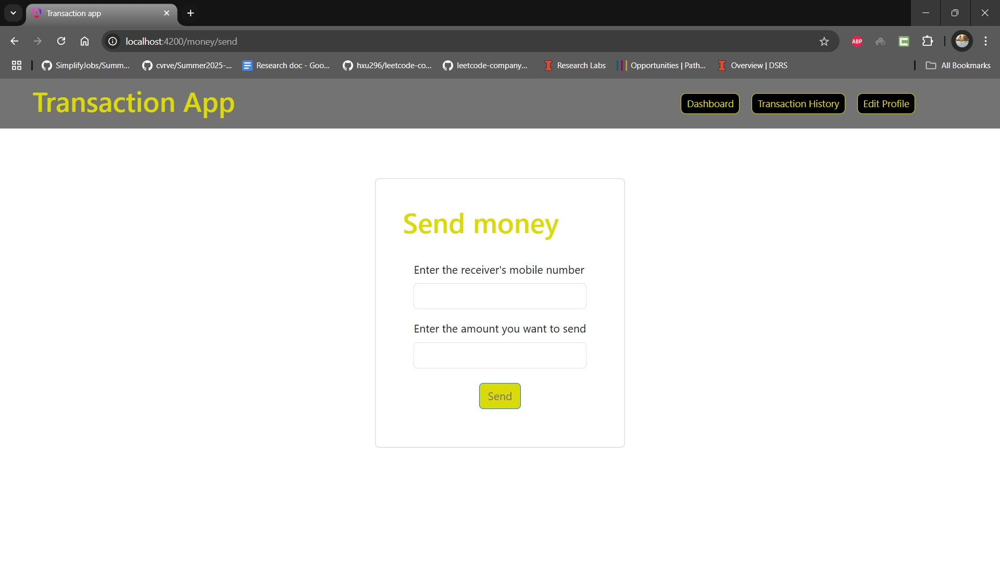

# SecureTransfer-Modern-Full-Stack-Money-Transfer-Platform
A robust and secure money transfer application built with built with Angular 19 and Spring Boot, enabling seamless financial transactions and user management. This full-stack solution demonstrates proficiency in both frontend and backend development, containerization, and database management.

# Features
## User Authentication
* Secure login and registration
* Profile management
* Session handling with localStorage
## Transaction Management
* Real-time money transfers
* Balance tracking
* Transaction history
## Routing & Navigation
* Protected routes
* Seamless page transitions
* Responsive user interface

# Tech Stack
## Frontend
* Angular 19
* Components
* TypeScript
* Bootstrap CSS
## Backend
* Spring Boot
* RESTful APIs
* MySQL Database
* JDBC Connection
## DevOps
* Docker containerization
* Docker Compose for service orchestration

# Getting Started
1. Clone the repository
2. Start the MySQL database using XAMPP
3. Run the Spring Boot backend
4. Start the Angular frontend
5. Access the application at http://localhost:4200

# Screenshots

## signup

## login

## Dashboard

## Transaction history

## Edit profile

## Deposite money

## send money

